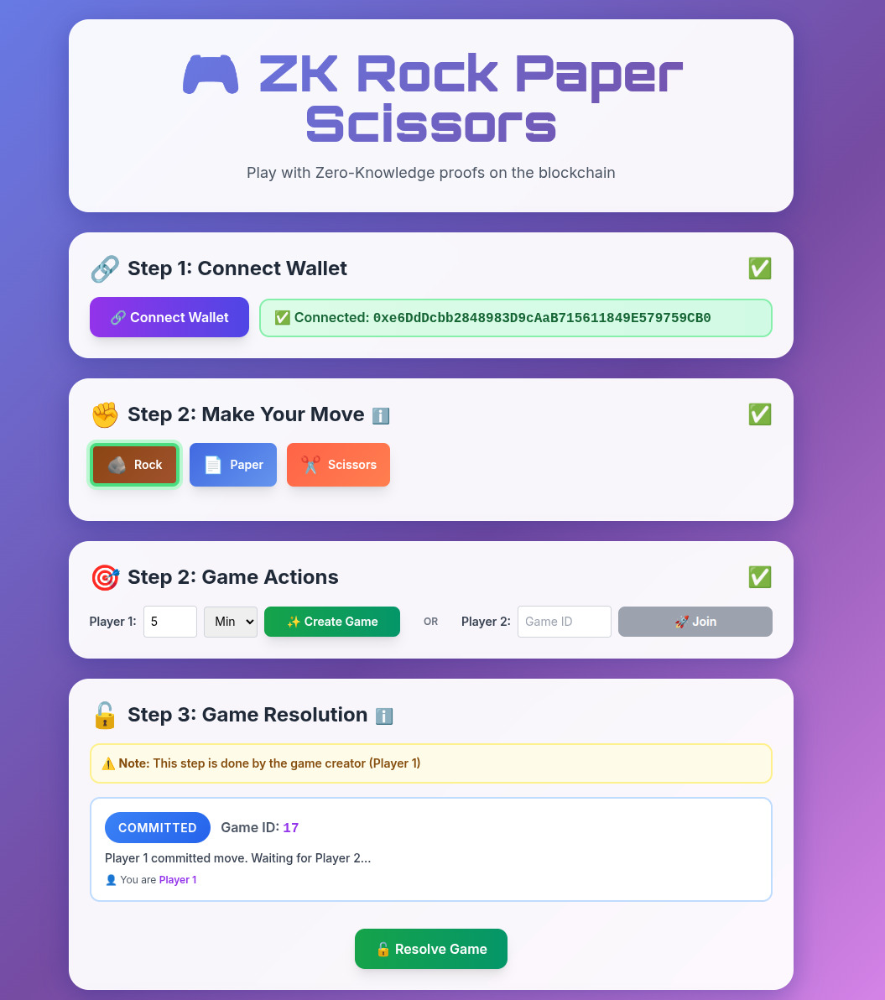

# ZK Rock Paper Scissors Game

[](https://www.gnu.org/licenses/gpl-3.0)

 


A zero-knowledge rock-paper-scissors game where players commit moves, reveal with ZK proofs, and resolve games on-chain. Built with **Noir**, **Barretenberg**, **Hardhat 3**, and **Ethereum**.



## Overview

Players generate zero-knowledge proofs using Noir circuits that prove:

- Both moves are valid (0=Rock, 1=Paper, 2=Scissors)
- The winner calculation is mathematically correct
- The game logic matches the smart contract's resolution logic

## Technology Stack

- **Noir**: Domain-specific language for ZK circuits
- **Barretenberg**: UltraHonk proof system backend (via `@aztec/bb.js`)
- **NoirJS**: JavaScript bindings for Noir circuits
- **Solidity 0.8.20**: Game logic and state management
- **Hardhat 3**: Development environment
- **Vite**: Frontend build tool
- **Ethers.js v6**: Ethereum interaction

## How Zero-Knowledge Works

### The Circuit (`circuit/src/main.nr`)

The Noir circuit validates moves and computes the winner:

```rust
fn main(
    player1_move: pub Field,  // Public input
    player2_move: pub Field,  // Public input
    winner: pub Field         // Public output
) {
    // Validates moves are 0, 1, or 2
    // Computes winner using determine_winner()
    // Asserts winner matches provided value
}
```

**What the proof proves:**

1. Both moves are valid (0, 1, or 2)
2. The winner calculation is correct according to game rules
3. The public `winner` field matches the computed result

### Commit-Reveal Scheme

To prevent front-running and ensure fair play:

1. **Commit Phase**:
   - Player 1 generates random salt and creates commitment: `keccak256(move || salt)`
   - Player 1 submits commitment hash to contract (move is hidden)
   - Player 2 joins by submitting their move directly (no commit needed)

2. **Reveal Phase**:
   - Player 1 reveals move + salt
   - Contract verifies `keccak256(move || salt) == commitment`
   - ZK proof generated proving winner calculation

3. **Resolution**:
   - Contract verifies ZK proof on-chain (if verifier is set)
   - Contract's `_resolveGame()` determines winner

## Game Flow

```
Player 1                     Contract                    Player 2
   |                            |                            |
   |-- createGame(commitment) ->|                            |
   |                            |                            |
   |                            |<-- joinGame(move2) -------|
   |                            |                            |
   |-- resolveGame(move+salt) ->|                            |
   |     + ZK proof             |                            |
   |                            |                            |
   |                            |-- _resolveGame() ----------|
   |<-- GameResolved event -----|                            |
```

## Project Structure

```
zk-rps/
├── circuit/                    # Noir ZK circuit
│   ├── src/main.nr           # Circuit: validates moves & determines winner
│   └── Nargo.toml            # Noir project config
├── contracts/                 # Solidity smart contracts
│   ├── contracts/
│   │   ├── RockPaperScissors.sol    # Main game contract
│   │   ├── Verifier.sol             # ZK proof verifier
│   │   └── RockPaperScissors.t.sol # Tests
│   ├── ignition/modules/
│   │   └── RockPaperScissors.ts    # Deployment module
│   └── hardhat.config.ts      # Hardhat 3 config
└── frontend/                  # Web frontend
    ├── index.html            # UI
    ├── app.js                # Game logic + ZK proof generation
    └── target/circuit.json   # Compiled Noir circuit
```

## Setup

### Prerequisites

- **Node.js** 18+ and npm
- **Noir** ([install instructions](https://noir-lang.org/docs/getting_started/nargo_installation))
- **MetaMask** (for wallet connection)

### 1. Install Dependencies

```bash
# Circuit dependencies (Noir comes with nargo)
cd circuit
nargo --version  # Verify installation

# Contract dependencies
cd ../contracts
npm install

# Frontend dependencies
cd ../frontend
npm install
```

### 2. Compile Circuit

```bash
cd circuit
nargo compile
nargo test  # Verify all tests pass
```

This generates `target/circuit.json` needed by the frontend.

### 3. Setup Frontend Artifacts

```bash
cd frontend

# Copy compiled circuit
mkdir -p target
cp ../circuit/target/circuit.json target/

# Contract artifact will be loaded from deployments.json after deployment
```

## Running Locally

### 1. Start Hardhat Node

```bash
cd contracts
npx hardhat node
```

This starts a local Ethereum node at `http://127.0.0.1:8545` with Chain ID `31337`.

### 2. Deploy Contract

In a new terminal:

```bash
cd contracts
npx hardhat ignition deploy ignition/modules/RockPaperScissors.ts --network localhost
```

The contract address will be saved to `frontend/deployments.json` automatically.

### 3. Start Frontend Dev Server

```bash
cd frontend
npm run dev
```

Visit `http://localhost:5173`

### 4. Fund Your Wallet

Hardhat node creates 20 accounts with 10,000 ETH each. Choose one:

**Option A: Import Hardhat Account to MetaMask**

- Copy a private key from the Hardhat node output
- In MetaMask: Account icon → Import Account → Paste private key

**Option B: Send ETH to MetaMask**

```bash
cd contracts
npx hardhat run scripts/fundWallet.ts --network localhost <YOUR_METAMASK_ADDRESS>
```

**Option C: Configure MetaMask Network**

- Network Name: `Hardhat Local`
- RPC URL: `http://127.0.0.1:8545`
- Chain ID: `31337`
- Currency Symbol: `ETH`

The frontend will automatically prompt you to switch networks if needed.

## Playing the Game

1. **Connect Wallet**: Click "Connect Wallet" in the UI
2. **Select Move**: Click Rock 🪨, Paper 📄, or Scissors ✂️
3. **Create/Join Game**:
   - Player 1: Click "Create Game" (move is committed)
   - Player 2: Enter Game ID and click "Join Game" (move is submitted directly)
4. **Resolve Game**: Player 1 clicks "Resolve Game"
   - Frontend generates ZK proof proving winner calculation
   - Proof is verified locally, then on-chain (if verifier is set)
5. **View Result**: Winner is announced after resolution

## How It Works

### ZK Proof Generation

When a player reveals their move (and opponent has also revealed):

1. **Compute Witness**: Noir circuit executes with:

   - `player1_move`: Field (private)
   - `player2_move`: Field (private)
   - `winner`: Field (public - computed result)

2. **Generate Proof**: Barretenberg backend creates a PLONK proof proving:

   - Moves are valid (0, 1, or 2)
   - Winner calculation matches circuit logic
   - Public output matches computed result

3. **Verify Locally**: Proof is verified before submission to ensure validity

4. **Submit to Contract**: Proof bytes are sent (on-chain verification pending)

### Smart Contract Logic

The contract handles:

- **Game State**: Manages game lifecycle (Waiting → Committed → Revealed → Completed)
- **Commitment Verification**: Validates `keccak256(move || salt) == commitment`
- **Winner Resolution**: Uses `_determineWinner()` matching circuit logic
- **ZK Proof Storage**: Receives proof bytes (verification pending)

### TODO

- **On-chain verification not yet implemented**: Proofs are generated and verified client-side, but contract doesn't verify them yet
- **To enable on-chain verification**: Generate verifier contract using Noir's verifier generation tools and integrate into `revealMove()`

## License

GPLv3
